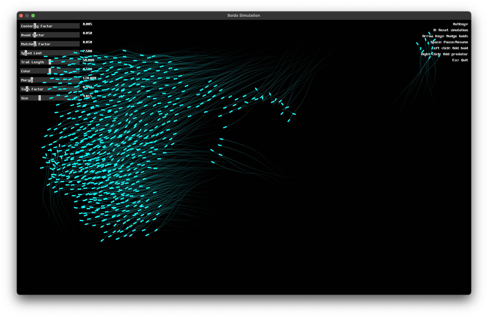

# Boids Simulation



Well I was going to do homework today, but then I watched Smarter Every Day's [video on murmurations](https://youtu.be/4LWmRuB-uNU) and thought it'd be a fun weekend project to implement a boids simulation in C++!

The simulation is based on Craig Reynolds' [Boids algorithm](https://en.wikipedia.org/wiki/Boids), which models the flocking behavior of birds using three simple rules: separation, alignment, and cohesion. This project implements these rules to create a visually appealing and dynamic flock simulation. The simplicity of the rules belies the complex emergent behavior that arises from their interaction. I also added a few more rules, like a speed limit, turning factor, and size, to make the simulation more interesting, and a slider for each parameter to tweak them on the fly. There's also a predator in the simulation that moves towards the center of mass of the boids, and the boids avoid it. It's not very realistic, but it's pretty to look at.

To render this thing, I used the [TIGR (Tiny Graphics) library](https://github.com/erkkah/tigr), an open-source, single-file graphics solution for OpenGL integration. I also am trying to make this thing scalable by hooking into Metal on MacOS, but it's not working yet. I've been trying to use [metal-cpp](https://github.com/bkaradzic/metal-cpp), and will hopefully get it working someday. The rest of the codebase was written by scratch (unless you count Codeium as cheating). Obviously the original ideas aren't mine (otherwise I might have a SIGGRAPH award!), I drew inspiration from various resources on boids and flocking algorithms, including [Conrad Parker's Boids Pseudocode](http://www.kfish.org/boids/pseudocode.html) and [Ben Eater's Boids implementation](https://eater.net/boids).

If you want to compile and run this yourself, I'd recommend running

```sh
./build.sh boids
```

if you're on MacOS. Otherwise, YMMV. You shouldn't need to install anything except `tigr.c` and `tigr.h`, but you will need to compile with the C++17 standard, because I'm using the algorithims package added in that version of the standard library. On MacOS I can compile with:

```sh
g++ -std=c++17 boids.cpp tigr.c -o boids -framework OpenGL -framework Cocoa
```

But if you're on Windows, this _should_ work instead, though I haven't tested it:

```sh
g++ -std=c++17 boids.cpp tigr.c -o boids -s -lopengl32 -lgdi32
```

I'm also trying to get this to compile with Metal on MacOS, but it's kinda hacky right now. You probably won't want to compile with it, but I'm keeping it here until (as in never) I get it working.
